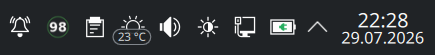
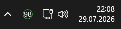

# MouseWatch

Battery monitor for supported wireless mice (MCHOSE and ATK). Runs as a system tray application on Windows and Linux - the tray icon shows the current battery percentage as a circular badge. Right-click the icon for settings and other options.

## Screenshots

Linux KDE



Windows



## Supported mice

### MCHOSE

M7, M7 Pro, M7 Ultra, L7, L7 Pro, L7 Pro+, L7 Ultra, L7 Ultra+, A7, A7 Pro, A7 Ultra, A7 Ultra(RE), A7 V2 Pro, A7 V2 Pro+, A7 V2 Ultra, A7 V2 Ultra+, A7X Ultra, K7 Ultra, A5 V2 Ultra, AX5 V2, G3 Ultra 8K, G3 Ultra 4K

### ATK

A9 Plus

Protocol/reference implementation used: [libatk-rs](https://github.com/cyberphantom52/libatk-rs/)

## Quick start

```
pip install -r requirements.txt
python src/mousewatch/mousewatch.py
```

Linux helper scripts:

```bash
./create_venv.sh
./run.sh
./build.sh
```

`./run.sh` automatically creates the venv first if it does not exist.

`./build.sh` creates/updates the venv, installs `requirements-dev.txt`, runs tests, then builds a standalone binary with PyInstaller.

Windows helper scripts:

```bat
create_venv.bat
run.bat
```

```powershell
.\create_venv.ps1
.\run.ps1
.\build.ps1
```

`run.bat` and `run.ps1` automatically create the venv first if it does not exist.

For Windows build tooling (PyInstaller), install dev dependencies:

```bat
venv\Scripts\python.exe -m pip install -r requirements-dev.txt
```

Optional custom venv path:

```bash
./create_venv.sh .venv
./run.sh .venv
```

Windows custom venv path:

```bat
create_venv.bat .venv
run.bat .venv
```

```powershell
.\create_venv.ps1 .venv
.\run.ps1 .venv
```

## Usage

```
python src/mousewatch/mousewatch.py                # auto-detect mouse, monitor in system tray
python src/mousewatch/mousewatch.py --once         # print battery once and exit
python src/mousewatch/mousewatch.py -t 15          # set low battery threshold to 15%
python src/mousewatch/mousewatch.py -i 60          # poll every 60 seconds
python src/mousewatch/mousewatch.py -m "L7 Ultra+" # skip auto-detection
python src/mousewatch/mousewatch.py --protocol atk --once --nogui
python src/mousewatch/mousewatch.py --probe --protocol atk --nogui
```

Protocol options:

- `--protocol auto` (default): choose the first protocol that detects a supported device
- `--protocol mchose`: force MCHOSE protocol
- `--protocol atk`: force ATK protocol

Probe mode (`--probe`) prints candidate HID interfaces, query results, and decoded protocol frames to help with protocol debugging.

## Running tests

Install runtime + development dependencies:

```bash
pip install -r requirements-dev.txt
```

Run tests:

```bash
pytest
```

If you use the project venv directly:

```bash
./create_venv.sh
./venv/bin/pip install -r requirements-dev.txt
./venv/bin/python -m pytest -q
```

## Settings

Right-click the tray icon and select **Settings** to configure:

- **Battery threshold** — percentage to trigger low battery alert (1-100%, default 20%)
- **Reminder interval** — minimum time between repeated low battery notifications (default 300s)
- **Poll interval** — how often to check the battery (default 300s)
- **Notification sound** — toggle notification sound on/off (Windows only)
- **Start with Windows / Start on login** — automatically launch on login

Settings are saved and persist across restarts. CLI arguments (`--threshold`, `--interval`) override saved settings when provided.

| Platform | Config path |
|----------|-------------|
| Windows | `%LOCALAPPDATA%\MouseWatch\settings.json` |
| Linux | `~/.config/mousewatch/settings.json` |

## Notifications

- **Low battery** — fires when battery drops below threshold (not while charging)
- **Fully charged** — fires once when battery reaches 100% while charging
- **Device connect/disconnect** — notifies when mouse USB state changes (toggleable)
- **Charge state changes** — real-time notification when cable is plugged/unplugged

## Wired mode

If the mouse is connected via USB cable at startup (no dongle), the app launches in charging mode and updates in real-time via HID input reports. Battery percentage polling requires the 2.4GHz dongle.

## Linux setup

Add a udev rule so the app can access the HID device without root:

```bash
sudo tee /etc/udev/rules.d/99-mousewatch.rules > /dev/null <<'EOF'
KERNEL=="hidraw*", ATTRS{idVendor}=="3837", MODE="0666", TAG+="uaccess"
KERNEL=="hidraw*", ATTRS{idVendor}=="41E4", MODE="0666", TAG+="uaccess"
KERNEL=="hidraw*", ATTRS{idVendor}=="0BDA", MODE="0666", TAG+="uaccess"
KERNEL=="hidraw*", ATTRS{idVendor}=="5253", MODE="0666", TAG+="uaccess"
KERNEL=="hidraw*", ATTRS{idVendor}=="373B", MODE="0666", TAG+="uaccess"
EOF
sudo udevadm control --reload-rules
sudo udevadm trigger
```

Then replug the dongle and run the app normally.

## Install as startup app

**Windows:**
```
install.bat
```
This builds a standalone `MouseWatch.exe` and adds it to Windows startup. Run `uninstall.bat` to remove.

`build.bat` installs development/build dependencies from `requirements-dev.txt` before running `python -m PyInstaller`.
PowerShell equivalent: `./build.ps1`.

**Linux:** Use the **Start on login** toggle in Settings. This creates an XDG autostart entry at `~/.config/autostart/mousewatch.desktop`.

To build a Linux standalone binary manually, run `./build.sh`.

## Platform differences

| Feature | Windows | Linux |
|---------|---------|-------|
| Tray backend | pystray | PySide6 QSystemTrayIcon |
| Context menu | pystray menu | Qt right-click menu |
| Settings/Debug UI | tkinter | Qt dialogs |
| Notifications | winotify toast | notify-send |
| Config path | `%LOCALAPPDATA%` | `~/.config` (XDG) |
| Login startup | `.lnk` in Startup folder | XDG autostart `.desktop` |
| HID backend | hidapi/libusb | hidraw |

## How it works

Communicates with the mouse via HID through the 2.4GHz USB dongle. Uses two channels:
- **Feature reports** (`0x11 0x06`) — periodic polling for battery level and status
- **Input reports** (`0xE2`) — real-time push notifications for charge state changes

MCHOSE protocol was reverse-engineered from the MCHOSE web configurator. ATK support is implemented with command/response framing derived from [libatk-rs](https://github.com/cyberphantom52/libatk-rs/) protocol notes.
